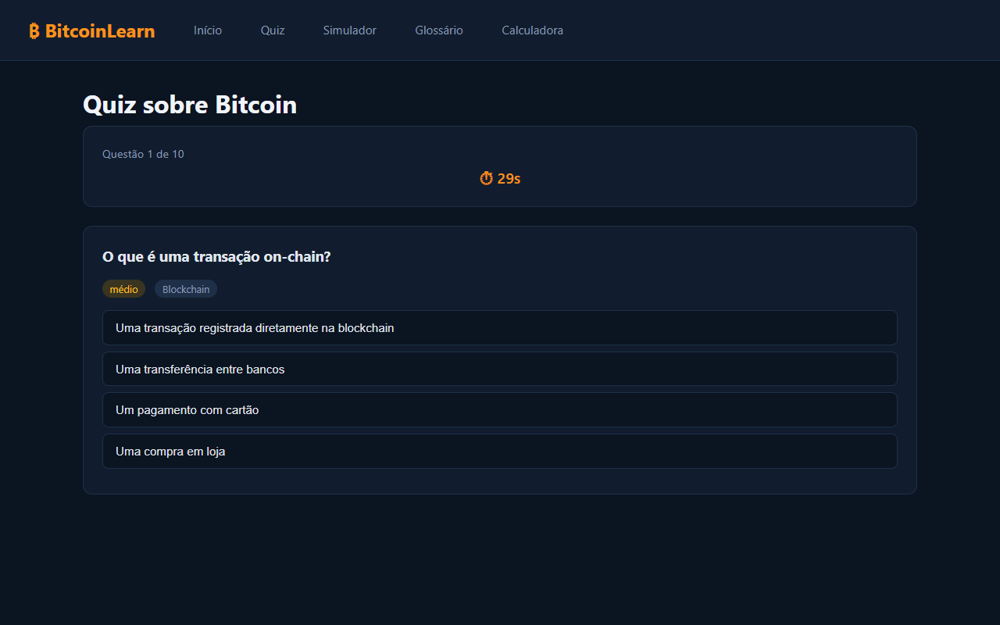
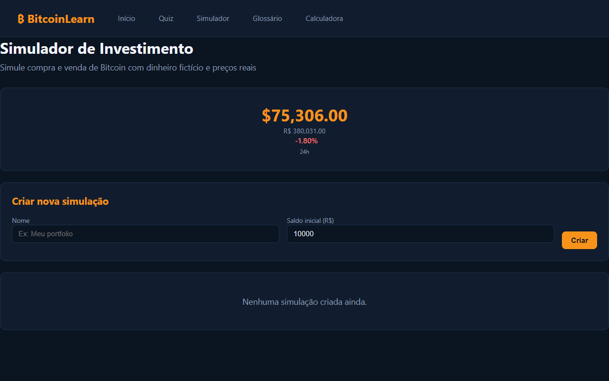
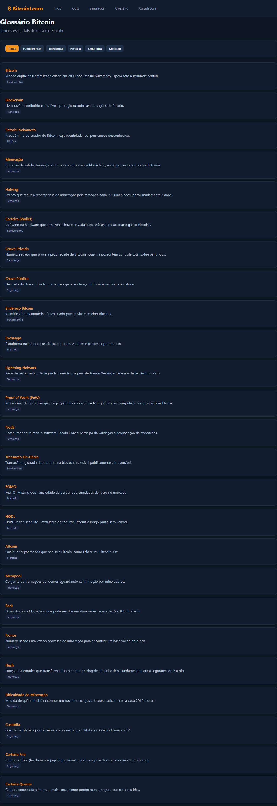
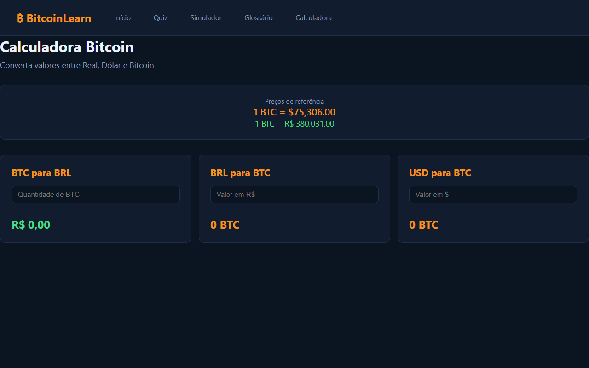

# BitcoinLearn 🪙

Plataforma educacional para aprender sobre Bitcoin com ferramentas interativas. Construída com Spring Boot + MongoDB.

🌐 **Deploy:** [bitcoinlearn.up.railway.app](https://bitcoinlearn.up.railway.app)

## Funcionalidades

- **Preços em tempo real** — cotações BTC/USD e BTC/BRL via CoinGecko (atualização a cada 60s)
- **Quiz interativo** — 20 perguntas sobre Bitcoin com 3 níveis de dificuldade e timer de 30s
- **Simulador de investimento** — crie simulações, compre/venda Bitcoin com dinheiro fictício e acompanhe lucro/prejuízo
- **Glossário** — +20 termos essenciais do universo Bitcoin categorizados
- **Calculadora** — converta entre BTC, BRL e USD com cotações reais

## Screenshots

### Página Inicial


### Quiz


### Simulador


### Glossário


### Calculadora


## Stack

| Camada | Tecnologia |
|--------|-----------|
| Backend | Java 17+, Spring Boot 3.4.4, Spring Data MongoDB |
| Frontend | Thymeleaf, HTML5, CSS3, JavaScript |
| Banco | MongoDB 8.x |
| Deploy | Railway |
| API | CoinGecko (preços BTC) |

## Pré-requisitos

- Java 17+ (JDK)
- Maven 3.9+
- MongoDB 8.x rodando em `localhost:27017`

## Rodar localmente

```bash
# Clone o repositório
git clone https://github.com/valentimpalacio/bitcoinlearn.git
cd bitcoinlearn

# Compile e execute
mvn clean package -DskipTests
java -jar target/bitcoinlearn-1.0.0.jar
```

Acesse em [http://localhost:8080](http://localhost:8080)

## Deploy no Railway

```bash
railway up
```

O deploy usa o `MONGODB_URI` configurado como variável de ambiente no Railway. O seed de dados (quiz + glossário) é automático na primeira execução.

## Estrutura

```
src/main/java/com/bitcoinlearn/
├── controller/       # Controllers Spring MVC
├── model/            # Entidades MongoDB
├── repository/       # Repositórios Spring Data
└── service/          # Regras de negócio (preços, quiz, simulação)

src/main/resources/
├── templates/        # Templates Thymeleaf
│   └── fragments/    # Fragmentos reutilizáveis (nav, preço, layout)
└── application.properties
```

## Licença

MIT
